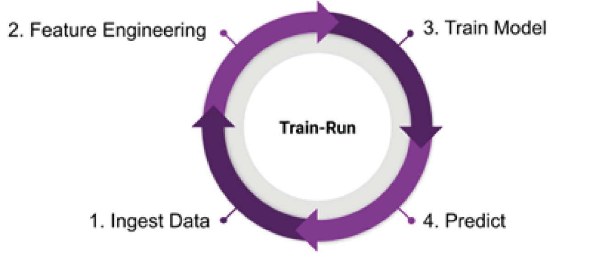
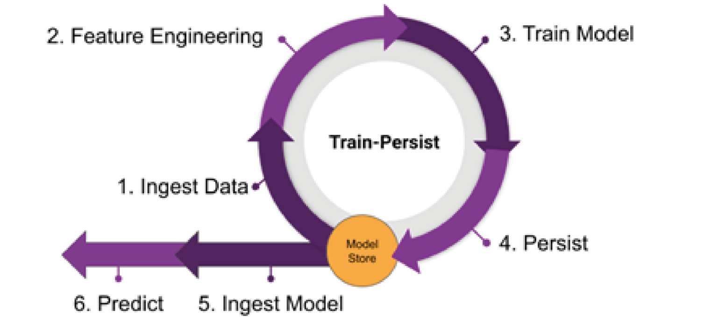
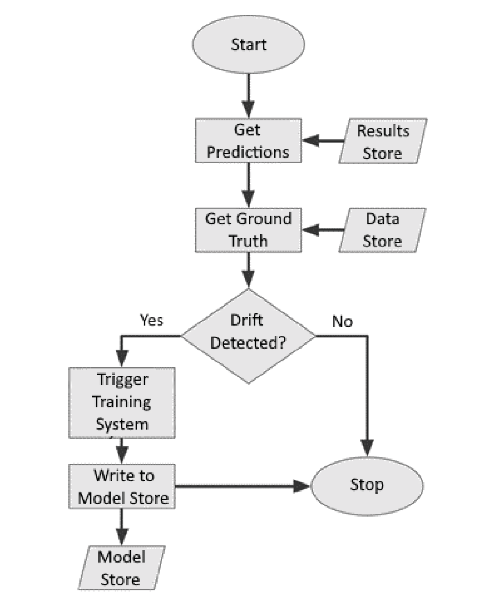
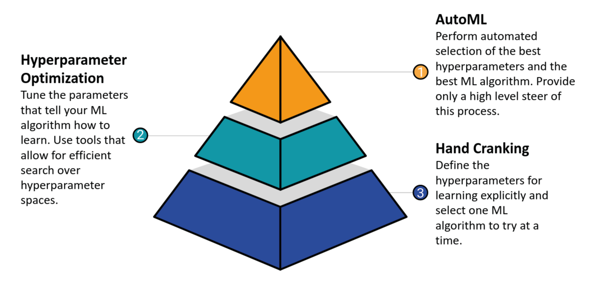

Notes include lessons from:
[Machine Learning Engineering with Python](https://www.amazon.in/Machine-Learning-Engineering-Python-production-ebook/dp/B09CHHK2RJ) by [Andrew P. McMahon](https://www.amazon.in/s?i=digital-text&rh=p_27%3AAndrew+P.+McMahon&s=relevancerank&text=Andrew+P.+McMahon&ref=dp_byline_sr_ebooks_1)


### Text and their meanings
 - **Use-Case**
 - *Example*
 - `technical word`
 - ```python
    this = is_some_python_code()
    ```


### Machine Learning Development Cycle
4 major steps in any cycle:
1. Discover
2. Play
3. Develop
4. Deploy

#### Develop
To have a versioned model development, we use `mlflow`.  
Like, *Using mlfow as a wrapper on top of FBProphet models*
```python
class ProphetWrapper(mlflow...):
    def __init__(self, model):
        # model initialization code
    .
    .
    .
    def predict():
        # function to return prediction on future data
```

Using mlflow like tools gives functionalities like:
1. Logging performance metrics
2. Printing more information about the model runs
3. Then saving the model as:
   - pickle objects
   - joblib
   - JSON
   - etc..


#### Deploy

Typical deployments are done on:  
1. On-prem
2. Cloud using
    - IaaS
    - Paas

Also, using concepts of CI/CD like *Github Actions* are used.


### From Model to Model Factory
One important aspect is to design how the model will be trained and how will it provide the output.

2 ways to do this:
1. train-run process


2. train-persist process


#### Identifying, when re-training is required

##### Drift
Drift is a term that covers a variety of reasons for your model's performance dropping
over time

##### Types of drift
1. Concept drift
   When there's some change in the relationships between the feature and the target predictions.
2. Data drift
   When there's a change in the statistical properties of the variables that are being used as features.

##### Detecting drift
*Using `alibi`*

General drift capture would look something like:


##### Working with categorical features

###### Ordinal Encoding
When the output of encoding is [1,2,3] for *Cereal, Toilet Roll and Bleach*.
But, they are not the the exact alternatives for each other. So this kind of introduces some bias in between the values, like, These numbers seem to suggest that cereal is to bleach as toilet roll is to cereal, and that the average of toilet roll and bleach is cereal.

```python
from sklearn import preprocessing
ordinal_enc = preprocessing.OrdinalEncoder()
ordinal_enc.fit(data)
# Print returns [[0.]
# [1.]
# [2.]]
print(ordinal_enc.transform(data)
```

###### One hot encoding
On the other hand, the appropriate way to encode *Cereal, Toilet Roll and Bleach*, is to use one-hot encoding which looks something like this:  

```python
onehot_enc = preprocessing.OneHotEncoder()
onehot_enc.fit(data)
# Print returns [[1. 0. 0.]
# [0. 1. 0.]
# [0. 0. 1.]]
print(onehot_enc.transform(data).toarray())
```
Here,
 - There's no enforced ordering
 - Every feature is orthogonal to others, so no average 

##### Working with numerical data

Requires values to be on a similar scale.
Some techniques to achieve this:
 - Standardization
 - Min max normalization
 - Feature vector normalization

##### Defining learning

Learning includes updating the parameteers and reduce the wrongness, which is captured using loss functions.

Examples of loss functions:
 - For regression
   - Mean squared error / L2 loss
   - Mean absolute error / L1 loss
 - For classification (binary)
   - Log/cross entropy loss
   - Hinge loss
 - And so on..

##### Reducing loss / improving learning rate

Examples of constant learning rate approaches
 - Gradient Descent
 - Batch Gradient Descent
 - Stochastic Gradient Descent
 - Mini-batch Gradient Descent

Also read, adaptive learning rate methods.

#### Hierarchy of automation in model optimization



#### Optimizing Hyperparameters

Popular libraries to do this:
 - Hyperopt
 - Optuna


#### Persisting models using MLFlow (model registry)

Setting up the backend

```shell
mlflow server \
--backend-store-uri sqlite:///mlflow.db \
--default-artifact-root ./artifacts \
--host 0.0.0.0
```

Logging metrics and parameters from models trained

```python
with mlflow.start_run(run_name="YOUR_RUN_NAME") as run:
  params = {
    'tol': 1e-2,
    'solver': 'sag'
  }

  std_scale_clf = make_pipeline(StandardScaler(), RidgeClassifier(**params))
  std_scale_clf.fit(X_train, y_train)

  y_pred_std_scale = std_scale_clf.predict(X_test)

  mlflow.log_metrics({
      'accuracy': metrics.accuracy_score(y_test, y_pred_std_scale),
      'precision': metrics.precision_score(y_test, y_pred_std_scale, average='macro'),
      'f1': metrics.f1_score(y_test, y_pred_std_scale, average='macro'),
      'recall': metrics.recall_score(y_test, y_pred_std_scale, average='macro')
  })
  mlflow.log_params(params)

  mlflow.sklearn.log_model(
    sk_model=std_scale_clf,
    artifact_path="sklearn-model",
    registered_model_name="sk-learn-std-scaleclf"
  )
```

Using the same model later

```python
model_name = "sk-learn-std-scale-clf"
model_version = 1
model = mlflow.pyfunc.load_model(model_uri=f"models:/{model_name}/{model_version}"
model.predict(X_test)
```


#### Model factory with pipelines

*Using scikit-learn*

```python
from sklearn.compose import ColumnTransformer
from sklearn.pipeline import Pipeline
from sklearn.impute import SimpleImputer

numeric_features = ['age', 'balance']
numeric_transformer = Pipeline(
  steps=[
    ('imputer', SimpleImputer(strategy='median')),
    ('scaler', StandardScaler())
])

categorical_features = ['job', 'marital', 'education','contact', 'housing', 'loan', 'default','day']
categorical_transformer = OneHotEncoder(handle_unknown='ignore')

preprocessor = ColumnTransformer(
  transformers=[
    ('num', numeric_transformer, numeric_features),
    ('cat', categorical_transformer, categorical_features)
])

clf_pipeline = Pipeline(
  steps=[
    ('preprocessor',preprocessor), 
    ('classifier', LogisticRegression())
])
clf_pipeline.fit(X_train, y_train)
```

